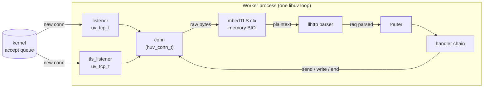
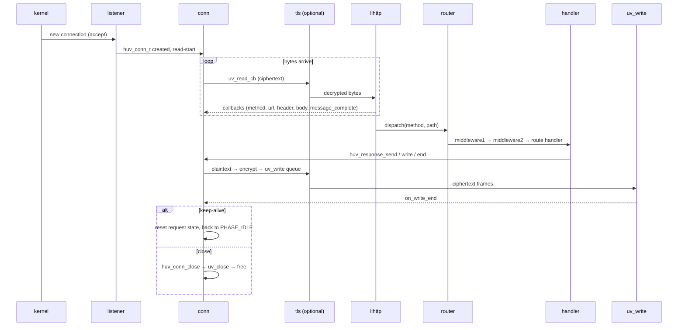
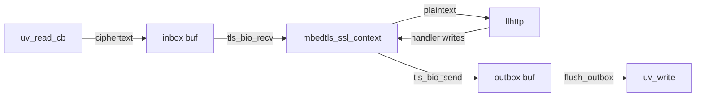

# Architecture

## Components

Each worker owns:

- a `uv_loop_t` it runs with `UV_RUN_DEFAULT`
- up to two listeners (plain and/or TLS)
- an SIGINT/SIGTERM `uv_signal_t` pair that kicks off graceful drain
- a doubly-linked list of `huv_conn_t` — current connections
- a router (table of method × path → handler) + middleware chain

A multi-worker server runs N such workers side-by-side; see
[workers.md](workers.md) for the master/worker split.

## The request lifecycle

### Phases

A connection moves through `PHASE_*` states (see `src/internal.h`):

- `PHASE_IDLE` — between requests on a keep-alive conn
- `PHASE_PARSING_REQUEST` — bytes arriving, not yet `message_complete`
- `PHASE_HANDLER` — request fully parsed, handler has `res`
- `PHASE_CLOSING` — draining writes before `uv_close`

Two timeouts watch these phases:

- `idle_timeout_ms` — applied in `PHASE_IDLE`
- `request_timeout_ms` — applied in `PHASE_PARSING_REQUEST` (slowloris
  mitigation)

## TLS memory-BIO bridge

libuv reads/writes raw bytes; mbedTLS wants to call its own `recv`/`send`.
The library bridges with a pair of in-memory queues per connection:

- `tls_bio_recv` reads from the inbox. Empty → returns `MBEDTLS_WANT_READ`
  so mbedTLS yields and we wait for more `uv_read_cb`.
- `tls_bio_send` appends to the outbox.
- `tls_pump` alternates: try to advance the handshake or read plaintext;
  flush whatever ended up in the outbox back through `uv_write`.

This means the TLS path is the same single-threaded, event-driven model as
the plain-HTTP path — no dedicated TLS threads, no blocking reads.

## Source map

| File                | Role                                                            |
| ------------------- | --------------------------------------------------------------- |
| `src/server.c`      | config, listeners, master/worker split, signals, shutdown drain |
| `src/conn.c`        | per-connection state machine, accept, read, parse, timeouts     |
| `src/router.c`      | static + parameterized route matching, 405 with `Allow`         |
| `src/request.c`     | header/query/param/body accessors                               |
| `src/response.c`    | status/headers, atomic send, streaming, chunked                 |
| `src/async.c`       | `huv_timer_defer`, `huv_work_submit`                          |
| `src/tls.c`         | mbedTLS ctx, BIO callbacks, handshake + decrypt/encrypt pump    |
| `src/buf.c`         | growable byte buffer used for inbox/outbox/body                 |
| `src/log.c`         | pluggable logger + default stderr writer                        |
| `src/internal.h`    | shared private types and prototypes                             |
| `include/http/*.h`  | the public API                                                  |

## Memory ownership rules

- `huv_request_t` and `huv_response_t` live as long as the handler has not
  sent the response. After the response drains, the connection either resets
  (keep-alive) or closes.
- Strings returned by `huv_request_*` accessors are valid for the request's
  lifetime. Copy them if you need to retain them past the handler.
- The server owns the loop + all handles. `huv_server_free` waits for them
  to close before returning.
