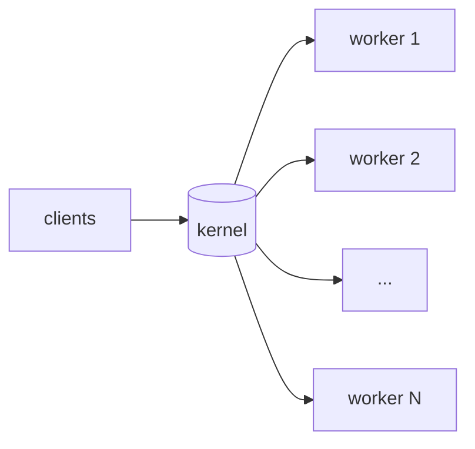

# Performance

## Running the benchmark

```bash
bash scripts/benchmark.sh
```

The script launches `example_tls` (plain HTTP on 8080, HTTPS on 8443,
same router) and drives it with `ab`. `example_tls` auto-detects the
online core count and forks one worker per logical CPU, so the numbers
reflect the whole box, not a single loop.

Results below are from a recent local run on an Intel i7-10610U (4C/8T,
1.8–4.9 GHz) — your numbers will differ with hardware, kernel, and build
flags. Use them as a shape check, not a spec.

| Endpoint           | TLS | Keep-alive | Conc | Reqs  |    Req/sec | ms/req | Failed |
| ------------------ | :-: | :--------: | :--: | :---: | ---------: | -----: | :----: |
| `/health`          | no  | yes        | 100  | 20000 | ~118 000   | 0.85   | 0      |
| `/health`          | yes | yes        | 100  | 20000 |  ~60 000   | 1.67   | 0      |
| `/health`          | no  | no         |  50  |  5000 |  ~18 400   | 2.72   | 0      |
| `/health`          | yes | no         |  50  |  5000 |     ~840   | 59.5   | 0      |
| `/hello?who=bench` | no  | yes        | 100  | 20000 | ~120 500   | 0.83   | 0      |
| `/hello?who=bench` | yes | yes        | 100  | 20000 |  ~54 400   | 1.84   | 0      |

Eight workers, one per logical core. The cliff at HTTPS-without-keep-alive
(~840 rps) is the cost of a full TLS handshake per request — even across 8
workers, the 2048-bit RSA key exchange dominates everything the server
actually does.

## Concurrency behaviour

Plain HTTP keep-alive `/health`, 8 workers, `ab -k -n 20000`:

| Conc |     Req/sec | mean ms | p50 ms | p99 ms |
| ---: | ----------: | ------: | -----: | -----: |
|    1 |      48 400 | 0.02    |   0    |   0    |
|   10 | **141 900** | 0.07    |   0    |   0    |
|   50 |     138 700 | 0.36    |   0    |   1    |
|  100 |     140 700 | 0.71    |   1    |   1    |
|  200 |      99 100 | 2.0     |   2    |   6    |
|  500 |      82 900 | 6.0     |   5    |  22    |
| 1000 |      83 500 | 12.0    |  10    |  44    |

Throughput plateaus around c=10–100 at ~141k rps. Past c=200 the
bottleneck shifts to the benchmark client (`ab` is single-threaded and its
own syscall load starts to dominate); server-side p99 stays under 50 ms
even at c=1000.

## Scaling with workers

Setting `cfg.workers = N` forks N processes sharing the listen socket via
`SO_REUSEPORT`. The kernel load-balances new connections across them, so
throughput scales roughly with core count for connection-bound workloads
(i.e., no keep-alive or short sessions).



Keep-alive clients pin to one worker for the life of the connection, so
the benefit only kicks in once you have many concurrent clients. See
[workers.md](workers.md).

Under a c=200 keep-alive burst, CPU was spread evenly across all 8
workers (9–15 % each; low because `/health` is trivial and `ab` couldn't
feed them faster). The master process stayed at 0 % — it only waits on
`waitpid` and forwards signals.

## Process footprint

8-worker `example_tls` at rest and under load:

| Process         | RSS idle  | RSS under load |
| --------------- | --------: | -------------: |
| master          | ~2.1 MB   | ~2.1 MB        |
| each worker     | ~2.2 MB   | ~2.7–3.3 MB    |
| **total**       | **~20 MB**| **~27 MB**     |

VSZ is identical across processes (shared text segment). Adding workers
is cheap — each one is roughly one page table + a libuv loop.

## Tuning knobs

**Connection limits** — raise `max_connections` (default 1024) if you're
serving more concurrent clients than that. Also check `ulimit -n`.

**Write queue** — `max_write_queue_bytes` (default 16 MiB) is the ceiling
for in-flight outbound bytes per connection. Slow clients can pile up
against this; the server closes the conn when they do, which is usually
what you want. If you legitimately stream large responses over slow links,
raise it.

**Timeouts** — `idle_timeout_ms` and `request_timeout_ms` default to 30s
each. Production services usually want these tighter (5–15s) to free up
loop slots from stalled peers.

**Thread pool** — `huv_work_submit` runs on libuv's pool. Default size is
4. Override via `UV_THREADPOOL_SIZE=16 ./your_server` when you offload a
lot of work. The pool is per-worker, so an 8-worker server with the
default already has 32 threads available for offload.

**Build** — the library builds with `-O3` under CMake's `Release` default.
Release is already set as default in `CMakeLists.txt`; a debug build
(`-DCMAKE_BUILD_TYPE=Debug`) is noticeably slower (10–30%).

**Logging** — for benchmarks, leave `cfg.log_cb = NULL`. The built-in
`huv_log_stderr` writes through a stderr mutex every `huv_log` call,
which costs roughly 10–15% at 100k rps. The examples set it because
they're demos; real workloads usually want a rate-limited sink or nothing.

## Where time actually goes

For plain HTTP keep-alive, a sub-millisecond response is roughly:

- ~200 µs: read + llhttp parse + router dispatch
- ~100 µs: handler body (this one just copies 2 bytes)
- ~300 µs: build response, `uv_write`, kernel TCP
- ~100 µs: everything else (syscall, accounting, logging)

For HTTPS keep-alive, add ~1 ms for encrypt/decrypt per request — the
AES-GCM record crypto is most of the gap.

Without keep-alive the HTTPS number is dominated by the handshake (RSA
key exchange at 2048-bit), not the record layer. Using ECDSA certs or TLS
resumption tickets reduces the cost, but neither are special-cased in the
library.

## Comparing to other servers

On the same machine, for a comparably trivial route:

- **nginx** (static `OK` response): ~150k rps plain KA
- **Go net/http**: ~80–120k rps plain KA (single process)
- **huv**: ~141k rps plain KA, 8 workers (~118k at the c=100 benchmark
  setting that the default script uses)

The library isn't trying to beat nginx — it's a study project. But the
event-loop + `SO_REUSEPORT` + worker-pool structure is the same recipe
nginx uses, so the numbers are in the same ballpark once you enable
workers.
