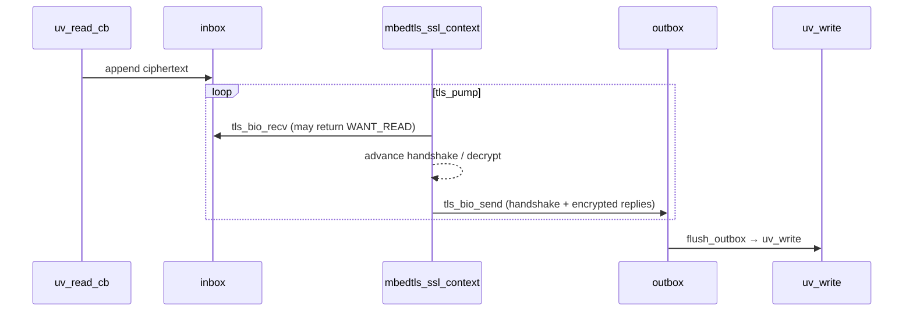

# TLS

The library ships mbedTLS support in the same process and loop as plain
HTTP. You can run:

- **plain HTTP only** — default
- **both HTTP and HTTPS** on two ports, sharing one router
- **HTTPS only** — set `port = 0`

## Enabling TLS

Set both cert and key paths. A second listener binds on `tls_port`:

```c
huv_server_config_t cfg = HUV_SERVER_CONFIG_DEFAULT;
cfg.port          = 8080;        /* or 0 for HTTPS-only */
cfg.tls_port      = 8443;
cfg.tls_cert_path = "server.crt";
cfg.tls_key_path  = "server.key";
```

The cert file is PEM; it may contain a chain (server cert first, then
intermediates). The key is PEM, unencrypted.

All registered routes serve on both listeners — there is no per-listener
router. That means `http://…/api/foo` and `https://…/api/foo` dispatch to
the same handler.

## Generating a self-signed cert (dev only)

The project build does this for you — see `CMakeLists.txt`:

```cmake
openssl req -x509 -newkey rsa:2048 -sha256 -days 365 -nodes \
    -keyout build/tls/server.key \
    -out    build/tls/server.crt \
    -subj   "/CN=localhost" \
    -addext "subjectAltName=DNS:localhost,IP:127.0.0.1"
```

Use a real CA-issued cert in production. Self-signed certs require
`--cacert` on curl and a trust-store override in browsers.

## How it plugs into libuv

libuv drives raw sockets. mbedTLS wants to call its own `recv`/`send`. The
bridge is a pair of in-memory byte buffers per connection — the *inbox*
(ciphertext arriving from the client, not yet fed to SSL) and the *outbox*
(ciphertext produced by SSL, not yet flushed to the socket):



`tls_bio_recv` returning `MBEDTLS_ERR_SSL_WANT_READ` on an empty inbox is
the whole trick — mbedTLS yields, libuv waits for more bytes, we resume.

The code lives in `src/tls.c` and is ~240 lines. Nothing in the handler-
or response-path knows about TLS: `submit_write` in `src/response.c`
branches once on `conn->tls`, and `huv_tls_encrypt_and_flush` hides the
rest.

## Tests and benchmarks

- `tests/test_tls.sh` — HTTPS smoke: correct status, cert presented,
  body integrity, keep-alive reuse, plain-HTTP coexistence, plain bytes to
  the TLS port rejected.
- `scripts/benchmark.sh` — plain vs HTTPS throughput side-by-side, with
  and without keep-alive. See [performance.md](performance.md) for a sample
  table.

## Caveats

- No HTTP/2 — this is HTTP/1.1 over TLS.
- No SNI-based multi-cert: one cert/key pair per server.
- Session tickets are left at the mbedTLS default. Resumption works across
  connections on the same process but not across worker boundaries.
- TLS adds noticeable CPU cost vs plain; plan for ~4–5× fewer req/s per
  core under keep-alive, ~50–100× fewer without keep-alive (full handshake
  per request).
