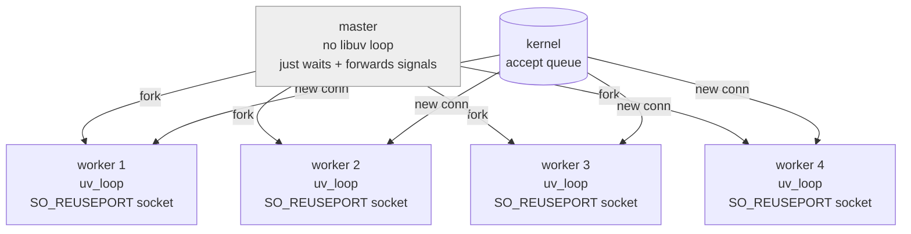

# Multi-worker mode

A single libuv loop is single-threaded. On a machine with N cores, you can
only use 1/N of the CPU that way. The library supports forking N workers
that each run their own independent loop, sharing the listen socket via
`SO_REUSEPORT`:

```c
huv_server_config_t cfg = HUV_SERVER_CONFIG_DEFAULT;
cfg.port    = 8080;
cfg.workers = 4;   /* fork 4 children */
```

Same configuration, same routes — the master just forks.

## Process layout



- The **master** never opens a libuv loop. It forks, installs
  `sigaction(SIGINT/SIGTERM)` handlers that forward the signal to every
  child via `kill(2)`, then `waitpid`s until all workers exit.
- Each **worker** calls `uv_loop_init` after the fork, binds its own
  socket with `SO_REUSEPORT + SO_REUSEADDR`, and hands it to libuv via
  `uv_tcp_open`. `uv_listen` finishes the setup.
- The kernel's accept queue balances new connections across the sockets.
  Existing connections stay on the worker that accepted them.

The `uv_loop_init` **must** happen after the fork — that's why
`huv_server_new` deliberately does not create the loop. If we forked with
an already-initialized loop, each child would inherit half-owned handles
and file descriptors.

## Implications

- **Connection affinity.** Once a TCP connection is accepted, all its
  requests stay on that worker. Keep-alive pins a client to one worker.
  That's why benchmarking `/pid` with `Connection: close` shows an even
  distribution, but with keep-alive you may see a single pid.
- **No shared in-process state.** Caches, counters, and rate-limit
  buckets in one worker are invisible to the others. Use Redis, a DB, or
  a shared-memory segment if you need coordination.
- **Crash isolation.** If one worker segfaults, the others keep serving.
  The master sees `WIFEXITED` / non-zero status and returns `-1` after all
  workers finish — you can wrap it in a supervisor that re-launches.
- **Automatic respawn (on by default).** When a worker exits abnormally
  (killed by signal or non-zero status), the master forks a replacement
  into the same slot. Clean `exit(0)`s — which only happen during
  orderly shutdown — are never respawned. A per-slot crash-loop guard
  retires a slot after 10 abnormal exits in any 60-second window, so a
  consistently broken handler can't fork-bomb the master. Set
  `respawn_workers = false` if you'd rather have an external supervisor
  (systemd, k8s, runit) own worker lifetime.
- **Shutdown.** `SIGINT` or `SIGTERM` to the master is forwarded to every
  worker; each worker runs its normal graceful drain (`shutdown_timeout_ms`).
  Master returns once all children have been reaped.

## Observing it

`examples/workers.c` sets `cfg.workers` to `sysconf(_SC_NPROCESSORS_ONLN)`
(one worker per online logical CPU) and exposes `/pid` returning the
handling worker's pid:

```
$ ./build/examples/example_workers &
$ for i in 1 2 3 4 5 6 7 8; do
    curl -s -H 'Connection: close' http://localhost:8080/pid
  done
pid=12345
pid=12346
pid=12347
pid=12346
pid=12348
pid=12345
pid=12347
pid=12348
```

`tests/test_workers.sh` verifies this automatically: fires 200
`Connection: close` requests, confirms >1 unique pid, then SIGINTs the
master and confirms every child exited cleanly.

## When NOT to use workers

- You fit comfortably on one core (most hobby apps).
- Your handlers rely on in-process shared state.
- You're using `huv_work_submit` heavily — the libuv thread pool inside
  a single worker often scales better for your case than more workers.
